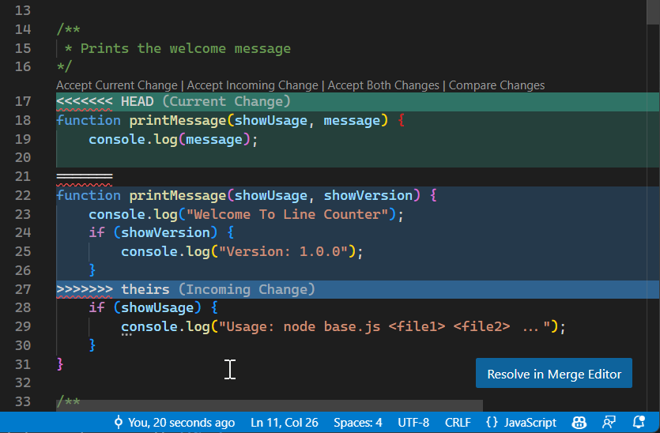

<style>
:root {
  font-family: 'SF Pro Text', serif !important;
}

code {
   font-family:  "Fantasque Sans Mono", monospace !important;
}

h1 {
  font-size: 2.5em !important;
  color: #1E1E1E !important;
}

section{
  justify-content: flex-start;
}

img[alt~="right"] {
  display: block;
  margin: 0 0;
  float: right;
}

img[alt~="center"] {
  display: block;
  margin: 0 auto;
}
</style>


# Git

---

## Cos'è Git?

Git è un sistema di controllo versione distribuito (VCS, Version Control System) che permette di tenere traccia delle modifiche apportate ai file di un progetto. Git permette di gestire la cronologia di tutte le modifiche apportate al proprio codice ma, a differenza di altri strumenti che lo hanno preceduto, lo fa in una maniera definita “distribuita”

È stato creato da Linus Torvalds nel 2005 per gestire lo sviluppo del kernel Linux.

---

Con git i dati vengono rappresentati come un insieme di snapshot di un mini file system. Ogni volta che si fa un commit, git salva uno snapshot dello stato dei file e tiene traccia di come questi file sono cambiati rispetto allo snapshot precedente.

Un commit è un'operazione che salva uno snapshot dei file nel repository. Ogni commit ha un messaggio che descrive le modifiche apportate.

Un repository è una directory che contiene i file del progetto e una cartella nascosta `.git` che contiene i metadati del repository.

---

## Stati di un file in Git

Un file in Git può trovarsi in tre stati principali:

1. **Modified**: il file è stato modificato ma non è stato ancora salvato nel repository.
2. **Staged**: il file è stato marcato per essere salvato nel repository.
3. **Committed**: il file è stato salvato nel repository.

---

## Comandi Git locali

- `git init`: inizializza un nuovo repository Git.
- `git add <file>`: aggiunge un file al repository. (in stato Staged)
- `git commit -m "messaggio"`: salva i file (da Staged) nel repository. (in stato Committed)
- `git status`: mostra lo stato dei file nel repository.
- `git log`: mostra la cronologia dei commit.
- `git diff`: mostra le modifiche apportate ai file.
- `git checkout <commit>`: sposta il repository allo stato di un commit specifico.

---

## Collaborazione con Git

Il punto di forza di Git è il supporto allo sviluppo distribuito. Git permette di collaborare con altri sviluppatori.

Per collaborare con altri sviluppatori è necessario utilizzare un repository remoto, come GitHub o GitLab.

Comandi utili:

- `git clone <url>`: clona un repository remoto. (lo scarica sul proprio computer)
- `git push`: invia i nostri commit al repository remoto.
- `git pull`: scarica i commit dal repository remoto.
- `git fetch`: scarica i commit dal repository remoto senza applicarli.

---

## Branching

Un branch è una linea di sviluppo separata. È utile per sviluppare nuove funzionalità senza influenzare il codice principale.

- `git branch`: mostra i branch presenti nel repository.
- `git branch <nome>`: crea un nuovo branch.
- `git checkout <branch>`: sposta il repository su un branch specifico.
- `git merge <branch>`: unisce un branch al branch attuale.


---

## Risoluzione dei conflitti

Un conflitto si verifica quando due branch hanno modificato lo stesso file nello stesso punto, e Git non sa quale versione mantenere.

Per risolvere un conflitto è necessario modificare manualmente il file in conflitto e poi fare un commit.

---



---

## Revertire un commit

Per annullare un commit è possibile utilizzare il comando `git revert <commit>`. Essendo Git pensato per mantenere la cronologia dei commit, il comando `revert` crea un nuovo commit che annulla le modifiche apportate dal commit specificato.

Per eliminare un commit è possibile utilizzare il comando `git reset`. Questo comando elimina il commit specificato e tutte le modifiche apportate da quel commit, è un'operazione pericolosa e non dovrebbe essere utilizzata su commit già inviati al repository remoto.

---

## Rinminare un commit

Per rinominare un commit è possibile utilizzare il comando `git commit --amend`. Questo comando permette di modificare il messaggio di commit dell'ultimo commit.

---

## Ignorare file

Per ignorare file è possibile creare un file `.gitignore` nella root del repository. In questo file è possibile specificare i file o le cartelle che si desidera ignorare. Ad esempio:

```bash
# Ignora tutti i file .log
*.log
# Ignora la cartella .vscode
.vscode/
# Ignora il file .env
.env
```

---

