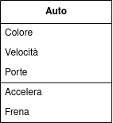
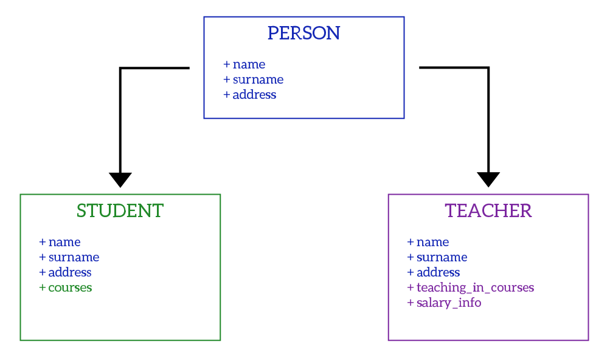

<style>
:root {
  font-family: 'SF Pro Text', serif !important;
}

code {
   font-family:  "Fantasque Sans Mono", monospace !important;
}

h1 {
  font-size: 2.5em !important;
  color: #1E1E1E !important;
}

section{
  justify-content: flex-start;
}

img[alt~="right"] {
  display: block;
  margin: 0 0;
  float: right;
}

img[alt~="center"] {
  display: block;
  margin: 0 auto;
}
</style>


# Programmazione a oggetti

---

## La programmazione

La programmazione è un’attività che si occupa di risolvere i problemi per mezzo di programmi eseguibili dai computer. Questa attività può essere suddivisa in quattro fasi:
- definizione del problema, dei dati di input e di output;
- organizzazione dell’algoritmo risolutivo;
- stesura del programma, cioè la traduzione dell’algoritmo nel linguaggio di programmazione;
- prove di esecuzione del programma.


---

## La programmazione

La programmazione strutturata ha permesso di costruire programmi ordinati e basati sull’organizzazione e la suddivisione dei programmi stessi in moduli funzionalmente indipendenti.
Con il passare del tempo, tuttavia, è aumentata la richiesta di sviluppare programmi sempre più complessi e in grado di gestire grandi quantità di dati.
Si è quindi sviluppato un nuovo stile di scrittura del codice, questo stile è detto programmazione ad oggetti. La programmazione ad oggetti è un paradigma di programmazione che permette di rappresentare i dati e le operazioni che possono essere eseguite su di essi in modo simile a quello che avviene nel mondo reale.

---

## Analisi

Durante la fase di analisi si crea un modello del sistema, individuando gli elementi di cui è formato e i comportamenti che deve avere. In questa fase non interessano le modalità con le quali i comportamenti vengono effettivamente implementati, ma soltanto gli oggetti che compongono il sistema e le interazioni tra essi.


---

## Analisi
Al contrario della programmazione strutturata, l’orientamento ad oggetti si focalizza sulla prima fase dell’attività di programmazione, cioè sull'**analisi dei dati**, che in questo contesto assumono il nome di **oggetti**.

Lo stile di programmazione orientato agli oggetti procura diversi vantaggi:
- facilità di lettura e di comprensione del codice
- rapidità nella manutenzione del programma nel tempo per correzioni o miglioramenti;
- robustezza del programma in situazioni che modellano sistemi complessi e con grandi quantità di dati;
- riusabilità del codice all’interno di altri programmi.

---

## Gli oggetti
un oggetto può essere definito elencando sia le sue caratteristiche (attributi), sia il modo con cui interagisce con l’ambiente esterno, cioè i suoi comportamenti (metodi).
Traducendo, un oggetto è composto da variabili e funzioni.

Un’automobile può essere vista come un oggetto in termini di caratteristiche e comportamenti.
Alcune sue caratteristiche sono: la velocità, il colore, il numero di porte, il livello del carburante e la posizione della marcia. Come si vede, queste caratteristiche possono descrivere le proprietà fisiche dell’oggetto, come il colore e il numero di porte, oppure possono mostrare lo stato dell’oggetto in un determinato momento, come la velocità e la marcia.
Tra i comportamenti (metodi) dell’oggetto automobile ci sono i seguenti: accelera, frena, gira, cambia marcia e rifornisciti.

---

## Le classi
**La classe è la descrizione astratta degli oggetti attraverso gli attributi e i metodi.**

Una classe viene rappresentata con uno schema grafico detto diagramma delle classi, che ne evidenzia il nome, gli attributi e i metodi. Il diagramma è costituito da un rettangolo diviso in tre: in alto si indica il nome della classe che viene definita, nella zona centrale l’elenco degli attributi e in basso l’elenco dei metodi.



---

## Le classi
Per utilizzare un oggetto occorre crearlo come esemplare della classe, cioè come istanza di una classe.
Ogni classe possiede un particolare metodo predefinito, detto **costruttore**, che viene invocato quando si crea un oggetto della classe. Il costruttore ha lo stesso nome della classe e non restituisce alcun valore.


---

## Incapsulamento
**Il termine incapsulamento indica la proprietà degli oggetti di incorporare al loro interno sia gli attributi che i metodi, cioè le caratteristiche e i comportamenti dell’oggetto.**
In pratica si crea una campana che isola l’oggetto dalle cose esterne. Si dice che gli attributi e i metodi sono incapsulati nell’oggetto. L’incapsulamento è una tecnica che permette di nascondere i dettagli di implementazione di un oggetto, rendendo più semplice la sua gestione e manutenzione.

---

## Dichiarazione di una classe
```java
public class Automobile {
    // attributi
    private String colore;
    private int numeroPorte;
    private int velocita;
    private int marcia;
    private int livelloCarburante;
    // metodi
    public void accelera() {
        velocita += 10;
    }
    public void frena() {
        velocita -= 10;
    }
    public void cambiaMarcia(int nuovaMarcia) {
        marcia = nuovaMarcia;
    }
    public void rifornisciti(int litri) {
        livelloCarburante += litri;
    }
    ...
}
```

---

## Dichiarazione di una classe
```java
public class Automobile {
    ...
    //costruttore
    public Automobile(String colore, int numeroPorte) {
        this.colore = colore;
        this.numeroPorte = numeroPorte;
        velocita = 0;
        marcia = 0;
        livelloCarburante = 0;
    }
}
```

---

## Creazione di un oggetto
Per creare un oggetto si utilizza l’operatore new seguito dal nome della classe e da eventuali parametri tra parentesi tonde.

```java
Automobile auto1 = new Automobile("rosso", 3);
Automobile auto2 = new Automobile("blu", 5);
```


---

## Creazione di un oggetto
Per convenzione, il nome della classe inizia con la lettera maiuscola, mentre il nome dell’oggetto inizia con la lettera minuscola. In questo modo è possibile distinguere facilmente la classe dall’oggetto.

---

## Visibilità degli attributi
Gli attributi di una classe possono essere dichiarati con quattro diversi livelli di visibilità:
- **public**: l’attributo è visibile da qualsiasi classe;
- **private**: l’attributo è visibile solo all’interno della classe;
- **protected**: l’attributo è visibile all’interno della classe e nelle sue sottoclassi;
- **<span style="color:red;">package</span>**: l’attributo è visibile all’interno della classe e nelle classi dello stesso package.

In aggiunta a questi quattro livelli di visibilità, è possibile dichiarare un attributo come **static**. Un attributo statico è un attributo della classe, cioè non è legato ad un oggetto specifico, ma è condiviso da tutti gli oggetti della classe.
Un altro attributo particolare è **final**, che indica che il valore dell’attributo non può essere modificato.

---

## Uguaglianza tra oggetti
A differenza delle variabili, due oggetti sono uguali solo se si riferiscono allo stesso oggetto, ovvero se punta allo stesso indirizzo di memoria. Per verificare se due oggetti sono uguali si utilizza il metodo equals().

```java
Automobile auto1 = new Automobile("rosso", 3);
Automobile auto2 = new Automobile("rosso", 3);
if (auto1.equals(auto2)) {
    System.out.println("Le due auto sono uguali");
}
```

---

## Oggetti null
Un oggetto null è un oggetto che non punta a nessun indirizzo di memoria. Un oggetto null non può essere utilizzato, altrimenti si verifica un’eccezione di tipo NullPointerException.

```java
Automobile auto1 = null;
auto1.accelera(); // NullPointerException
```

---

## Utilizzo degli oggetti
Per accedere agli attributi e ai metodi di un oggetto si utilizza l’operatore punto (.).
```java
Automobile auto1 = new Automobile("rosso", 3);
auto1.velocita = 50;
auto1.accelera();
```
Nel nostro caso l’attributo velocita è dichiarato come private, quindi non è possibile accedervi dall’esterno della classe. Per accedere a questo attributo è necessario utilizzare dei metodi pubblici che permettono di accedere e modificare l’attributo.

```java
public int getVelocita() {
    return velocita;
}
public void setVelocita(int nuovaVelocita) {
    velocita = nuovaVelocita;
}
```

---

## Information hiding

L’information hiding è una tecnica di programmazione che consiste nel nascondere i dettagli di implementazione di un oggetto, rendendo più semplice la sua gestione e manutenzione. In particolare, gli attributi di un oggetto dovrebbero essere dichiarati come private e l’accesso ad essi dovrebbe essere permesso solo attraverso dei metodi pubblici.
Solitamente i due metodi per leggere e modificare il valore degli attributi vengono indicati con i termini **get** e **set**.

---

## Interfacce

Un’interfaccia è un insieme di metodi che descrivono il comportamento di un oggetto. Una classe può implementare più interfacce, cioè può avere più comportamenti. Per implementare un’interfaccia si utilizza la parola chiave implements.

```java
public interface Veicolo {
    public void accelera();
    public void frena();
    public void cambiaMarcia(int nuovaMarcia);
    public void rifornisciti(int litri);
}
```

```java
public class Automobile implements Veicolo {
    ...
}
```

---

## I vantaggi dell'information hiding

Se ad esempio si volesse cambiare il modo in cui vengono cambiate le marce, basta modificare il metodo cambiaMarcia() della classe Automobile, senza dover modificare il codice che utilizza l’oggetto.

```java
public class Automobile implements Veicolo {
    ...
    public void cambiaMarcia(int nuovaMarcia) {
        if (nuovaMarcia >= 0 && nuovaMarcia <= 5) {
            marcia = nuovaMarcia;
        } else {
            System.out.println("La marcia non esiste");
        }
    }
}
```

---

## I vantaggi dell'information hiding

Il programmatore è il meccanico che conosce i dettagli del funzionamento dell’automobile, mentre il pilota che la utilizza si limita ad utilizzare i comandi che gli sono stati forniti.

Da questo principio è nato il concetto di **componenti software**, il contenuto dei componenti rimane nascosto, mentre viene fornita una interfaccia per utilizzarli.


---

## Realizzazione di un programma
Nei linguaggi di programmazione orientati agli oggetti, l’attività principale consiste nella progettazione delle classi. Questa attività, eseguita durante l’analisi del problema, ha il compito di individuare le classi dettagliando le loro caratteristiche (attributi) e il modo con cui interagiscono tra di loro (metodi). Inizialmente le classi possono essere descritte in maniera sintetica utilizzando il diagramma delle classi. La fase successiva alla progettazione delle classi è la loro implementazione tramite un linguaggio di programmazione, nel nostro caso Java.

---

## Realizzazione di un programma
Un programma object-oriented scritto in Java è solitamente composto da più classi.
Una classe può essere definita in un file separato, oppure più classi possono essere definite nello stesso file. È buona norma definire una classe per ogni file, utilizzando il nome della classe come nome del file.
Tra tutte le classi definite in un programma, una di esse deve contenere il metodo `main()`, che viene eseguito quando il programma viene avviato.

---

## Array di oggetti
Un array può contenere oggetti, in questo caso l’array contiene i riferimenti agli oggetti.

```java
Automobile[] auto = new Automobile[10];
```

Dopo la dichiarazione, l’array contiene 10 riferimenti null. Per creare un oggetto e inserirlo nell’array si fa come segue:

```java
auto[0] = new Automobile("rosso", 3);
```

Siccome non possiamo umanamente creare 10 oggetti, possiamo utilizzare un ciclo for per creare gli oggetti e inserirli nell’array.

```java
for (int i = 0; i < auto.length; i++) {
    auto[i] = new Automobile("nero", random.nextInt(5) + 1);
}
```

---

## Ereditarietà
L’ereditarietà è una tecnica di programmazione che permette di definire una nuova classe a partire da una classe già esistente, ereditandone gli attributi e i metodi. La classe che viene ereditata viene detta **superclasse** o **classe base**, mentre la classe che eredita viene detta **sottoclasse** o **classe derivata**.



---

## Ereditarietà
Per definire una classe che eredita da un’altra classe si utilizza la parola chiave **extends**.

```java
public class Veicolo {
    private int velocita;
    Veicolo(velocita) {
        this.velocita = velocita;
    }
}
```

```java
public class Automobile extends Veicolo {
    Automobile(int velocita) {
        super(velocita);
    }
}
```

---

## Ereditarietà
L’ereditarietà consente quindi di condividere ciò che è simile tra le classi, con la possibilità di inserire le differenze. In questo modo si evita di dover riscrivere il codice che è comune tra le classi.
La nuova classe si può differenziare dalla classe base in due modi:
- aggiungendo nuovi attributi e metodi (**estensione**);
- modificando gli attributi e i metodi della classe base (**ridefinizione**).

Quando una sottoclasse ridefinisce un metodo si dice che lo sovrascrive (**overriding** del metodo) utilizzando lo stesso nome usato dalla superclasse.

---

## Ereditarietà
Esisitono due tipi di ereditarietà, singola e multipla. L’ereditarietà singola è quella che abbiamo visto finora, una classe può ereditare da una sola classe base. L’ereditarietà multipla è quella che permette di ereditare da più classi base, questa tecnica non è pienamente supportata da Java. In Java è possibile ereditare da una sola classe base, ma è possibile implementare più interfacce.


---

## Ereditarietà
Tutti gli oggetti in Java derivano dalla classe Object, che è la classe base di tutte le classi. La classe Object contiene i metodi più comuni che possono essere utilizzati da tutte le classi, come ad esempio il metodo equals(), che si può volendo ridefinire.

```java
public class Veicolo {
    ...
    public boolean equals(Object o) {
        if (o instanceof Veicolo) {
            Veicolo v = (Veicolo) o;
            return velocita == v.velocita;
        } else {
            return false;
        }
    }
}
```

---

## Polimorfismo
Il polimorfismo è una caratteristica della programmazione ad oggetti che permette di utilizzare un oggetto di una sottoclasse al posto di un oggetto della superclasse. In questo modo è possibile utilizzare un oggetto in maniera generica, senza dover conoscere il tipo specifico dell’oggetto.

```java
Veicolo v = new Automobile("rosso", 3);
```

In questo caso la variabile v è di tipo Veicolo, ma contiene un oggetto di tipo Automobile. Questo è possibile perché Automobile è una sottoclasse di Veicolo, quindi un oggetto di tipo Automobile è anche un oggetto di tipo Veicolo. Non è possibile fare il contrario, cioè utilizzare un oggetto di tipo Veicolo al posto di un oggetto di tipo Automobile.

---

## Polimorfismo
Nei linguaggi ad oggetti esistono due tipi di polimorfismo:
- **Overriding** del metodo: una sottoclasse ridefinisce un metodo della superclasse;
- **Overloading** del metodo: una classe ridefinisce un metodo con lo stesso nome, ma con parametri diversi.

---

## Overriding
L'overriding di un metodo consiste nel ridefinire, nella classe derivata, un metodo ereditato dalla classe base, con lo scopo di modificarne il comportamento. Il nuovo metodo deve avere lo stesso nome e gli stessi parametri del metodo ereditato.

```java
public class Cerchio {
    ...
    public double area() {
        return Math.PI * raggio * raggio;
    }
}

public class Cilindro extends Cerchio {
    ...
    public double area() {
        return 2 * super.area() + altezza * 2 * Math.PI * raggio;
    }
}
```

---

## Overloading
L'overloading di un metodo consiste nel ridefinire, nella stessa classe, un metodo con lo stesso nome, ma con parametri diversi. Il metodo ridefinito deve avere lo stesso nome del metodo originale, ma deve avere un numero diverso di parametri o parametri di tipo diverso.

```java
public class Cerchio {
    ...
    public double area() {
        return Math.PI * raggio * raggio;
    }
    public double area(double raggio) {
        return Math.PI * raggio * raggio;
    }
    public double area(double raggio, double altezza) {
        return 2 * area(raggio) + altezza * 2 * Math.PI * raggio;
    }
}
```

---

## Overloading
Un altro esempio di overloading è il metodo println() della classe PrintStream, che permette di stampare a video un valore di un certo tipo.

```java
public class PrintStream {
    public void println(char x) {
        ...
    }
    public void println(int x) {
        ...
    }
    public void println(double x) {
        ...
    }
    public void println(String x) {
        ...
    }
}
```